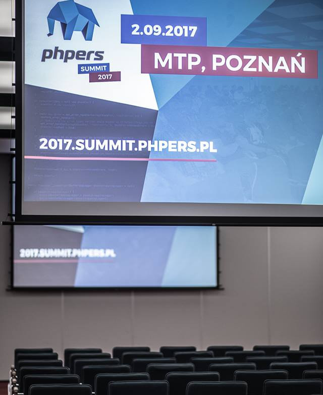
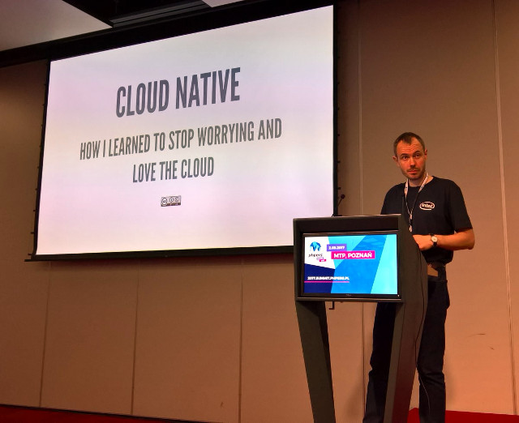
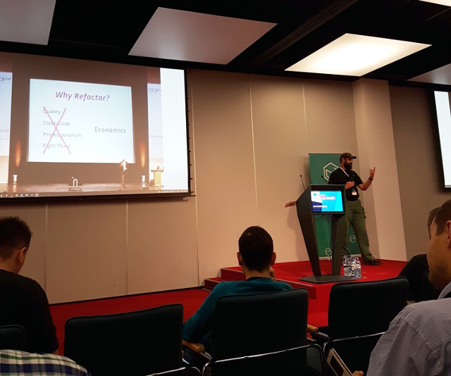
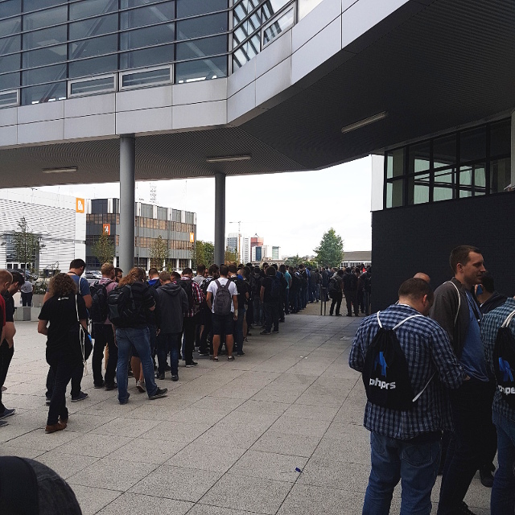

Cześć, chciałbym się z Wami podzielić krótką relacją z **PHPers Summit 2017**.
Konferencja drugi rok z rzędu zorganizowana została w Poznaniu na terenie Międzynarodowych Targów Poznańskich.

Wśród prelegentów bardzo ucieszyła mnie obecność Mariusza Gila jednego z założycieli PHPersów i aktywnego uczestnika społeczności PHP. To właśnie od jego wykładu zaczęła się konferencja.
Mariusz mówił **o modelowaniu procesów biznesowych z użyciem wzorca Sagi**. Podawał przykłady event stormingu z klientami, podczas których, nierzadko klient uświadamiał sobie, że procesy, które do tej pory wydawały mu się logiczne, nie są takimi do końca.
Skoro jesteśmy już przy Mariuszu, chciałbym polecić wszystkim jego rozmowę z Maćkiem Aniserowiczem na kanale devtalk.

[DevTalk51 – O PHP z Mariuszem Gilem](https://devstyle.pl/2017/03/06/devtalk51-o-php-z-mariuszem-gilem/)

Kolejny wykład był poświęcony **wykrywaniu błędów w kodzie za pomocą PHPStorma i zintegrowanego z nim TeamCity**.
Niestety był to w mojej opini najsłabszy wykład, pomimo tego, że prowadzący zrobił demko „live” całego procesu, za co napewno należy się uznanie. Jednak wiedza, którą przekazał była raczej podstawowa, skierowana do ludzi, którzy zaczynają swoją przygodę z Continous Integration.
Chociaż była też jedna ciekawostka.
JetBrains nie wspiera integracji pomiedzy PHPSTORMem i TeamCity, pomimo iż są to produkty tej właśnie firmy :)
Prelegent pokazał nawet maile, które wymieniał z działem wsparcia technicznego na temat możliwości integracji, ale niestety, JetBrains nie przewiduje w najbliższym czasie dodania wsparcia dla PHPSTORMa.

Kolejny był Maciej Iwanowski z Intela, który mówił **o zagadnieniach związanych z orkiestracją zadań w systemach rozproszonych**.
Bardzo techniczny wykład o problemach skalowalności, o potrzebie monitoringu i automatyzacji. Wszystko poparte doświadczeniami, jakie Maciek zdobył pracując w chmurze. Bardzo ciekawa była analiza awarii z 28 lutego 2017 roku, której uległ S3 w regionie us-east-1 i jakie pociągnęło to za sobą konsekwencję. Przyczyną awarii był błąd ludzki a dokładniej ustawienie złej zmiennej dla ansiblowego playbooka, co spowodowało niedostępność usługi, w konsekwencji czego padły EC2, EBS.

Następny był Michał Łukaszewski z wykładem **„Jak naprawić kod, żeby nie zepsuć aplikcaji”**.
Michał to osoba ze świetną charyzmą, bardzo dobrze słucha się jego wykładów. To nie był kolejny wykład o tym „jak ogarnąć legacy”.
Michał starał się wytłumaczyć, dlaczego warto robić refactor, jak przekonać klienta, że refactor jest bardzo istonym procesem i jakich użyć metodologi, aby refactor wpiąć do naszej codziennej pracy.

A na obiad czekaliśmy tak ...

Po przerwie obiadowej nadszedł czas na wykład o **Google S2 Geometry Library**.
Tomasz Gramza z OLX opowiadał o wdrożeniu biblioteki do ich projektu. Opowiedział także o algorytmach i strukturach danych używanych przez Google Maps. Prezentacja Tomka jest dostępna tutaj:

[Prezentacja - Google Geometry Library](https://speakerdeck.com/tomaszgramza/having-fun-with-geospatial-data-in-your-software-an-introduction-to-googles-s2-geometry-library)

Bardzo ciekawym wykładem był **„Goodbye REST, welcome GRPC”**.
Paweł pokazywał zalety implementacji gRPC w apliakacji BlaBla Car.
GRPC to framework protokółu zdalnego wywołania procedur (RPC) dostarczony przez Google wykorzystujący HTTP/2.
Dla zainteresowanych zgłębieniem tematu polecam stronę:

[https://grpc.io/docs/](https://grpc.io/docs/)

Podsumowując Poznańskie **PHPers Summit**, mogę śmiało powiedzieć, że nie zawiodłem się po raz kolejny.
Duża dawka nowej wiedzy i ciekawi prowadzący. 400 uczestników (o 100 więcej niż w zeszłym roku) pokazuje, że Poznańskie PHPers Summit może na stałe wpisać się do kalendarza konferencji programistycznych w Polsce.
